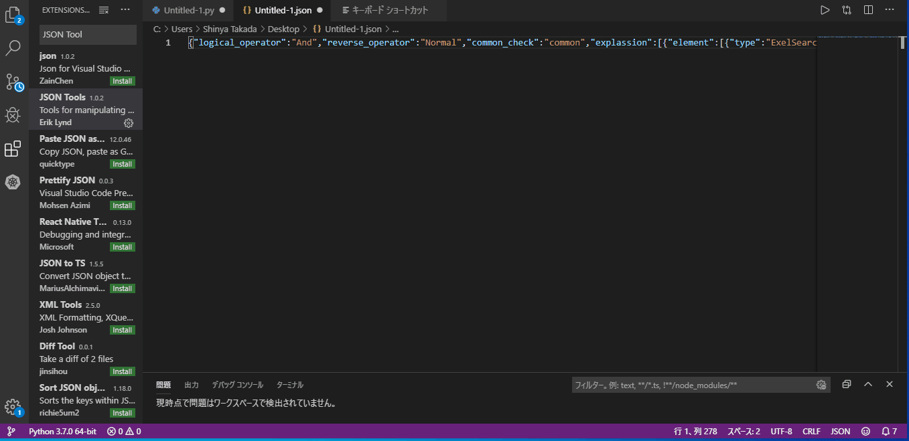

# JSONを簡単に編集するために
------
- Visual Studio Code を使うのが便利そう。

- アドインとして「JSON Tools」を追加。 
  - Ctrl + Alt + M で 分解
  - Alt + M で 再結合(１ラインになる)
- コード構成チェック付き 赤でエラーを示してくれる
- 要素のコピペもエディタ上でできるので簡単。
- よく使う書式はスニペットで登録すれば、Ctrl + ? でフォーマッタを入れることも可能。  
　※  Ctrl + e を入力すれば、以下が勝手に入るとか。
        "element": [
            {
                "type": "ExelSearch",
                "sheet": "",
                "address": ""
            },
            {
                "type": "Relational",
                "relational": "="
            },
            {
                "type": "",
                "value": ""
            }
        ]

## 前提条件 
--------
- 現在のVBライクなJSONでは対応不可。一文構文の変更必要。
  - シングルクォートはダブルクォートに変更(JSONはこれが本来)
  - 円マークは 円マーク×２つ に書き換え（エスケープシーケンス）  
→ 新規分はそのまま。JSON文法冒頭に「ver:」要素を追加し、変更分からは「ver:2」として、今後作る分は上のような書式を採用してはどうか？